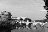
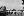
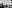
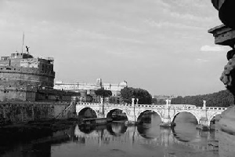
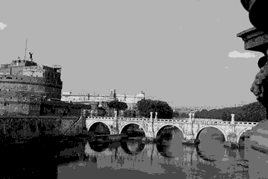
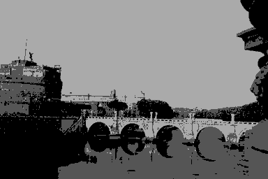
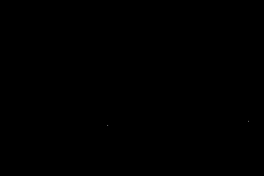

#HW1:Fundamentals
###林义涵（学号：13331158  计应1班）
##1 Exercises
###1.1 Storage
1. There are **256** bit planes for this image.  
2. The panel **256** is the most visually significant one.  
3. 2048 * 2048 * 256 / 8 = 1.342 * 10^8  
So **1.342 * 10^8** bytes are required for storing the image.
###1.2 Adjacency
1. For the shortest 4- path between p and q, there is no such a particular path, since the pixels around q are 0, 4, 4.
2. For the shortest 8- path between p and q, the length is **4**.
3. For the shortest m- path between p and q, the length is **5**.
###1.3 Logical Operations
1. \\[Solution=A\bigcap B\bigcap C\\]
2. \\[Solution=(A\bigcap B)\bigcup(B\bigcap C)\bigcup(C\bigcap A)\\]
3. \\[Solution=(B-A)+(A\bigcap C)-(B\bigcap C)\\]
##2 Programming Tasks
###2.1 Pre-requirement
**Input** My student ID is "13331158", so my picture is "**58.png**".  
**Language** The language I choose is **Python**, and the library I choose is **PIL**.
###2.2 Scaling
1. The **192\*128** result is:   
The **96\*64** result is:   
The **48\*32** result is:   
The **24\*16** result is:   
The **12\*8** result is: 
2. The **300\*200** result is:   
3. The **450\*300** result is:   
4. The **500\*200** result is:   
5. First, get the width and the height from the "input\_img" and the "output\_img" and calculate the "scale\_width" and the "scale\_height".The width and the height of the "output\_img" are called "target\_width" and "target\_height".  
Second, get the data from the "imput\_img" and put into a list. New a image called "result" to store the output data.
Third, choose some data from original image to fill the "result".

		for i in range(target_height):
    	   for j in range(target_width):
            result.append(resource[int(i * scale_height) * original_width + int(j * scale_width)])
###2.3 Quantization
1. The **128** gray level result is:   
The **32** gray level result is:     
The **8** gray level result is:   
The **4** gray level result is:   
The **2** gray level result is: 
2. First, new a "result" image with the same width and height like "input\_img". Create a variable called "level\_height", for example, divide [0, 255] into 4 levels, the "level_height" means the level unit "85".
Second, use the "level\_height" to reduce the gray level resolution of all the pixels and put into the "result" image.

		for i in range(original_height):
       		for j in range(original_width):
           		result.append(int(resource[i * original_width + j] / level_height) * level_height)