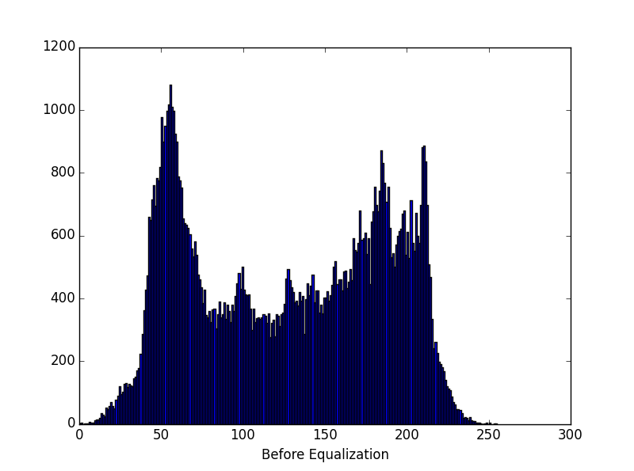

#HW1:Histogram and Spatial Filtering
###林义涵（学号：13331158  计应1班）
##1 Exercises
###1.1 Histogram Equalization
Let n = MN be the total number of pixels and let \\(n\_{r\_j}\\)  be the number of pixels in the input image with intensity value \\(r\_j\\) . Then, the histogram equalization transformation is  
\\[s\_k=T(r\_k)=\Sigma ^k\_{j=0}n\_{r\_j}/n=\frac{1}{n}\Sigma ^k\_{j=0}n\_{r\_j}\\].
So it follows that \\(n\_{s\_k} = n\_{r\_k}\\). A second pass of histogram equalization would produce value \\(v\_k\\) according to the transformation
\\[v\_k=T(s\_k)=\frac{1}{n}\Sigma ^k\_{j=0}n\_{s\_k}\\].
But, \\(n\_{s\_j} = n\_{r\_j}\\), so
\\[v\_k=T(s\_k)=\frac{1}{n}\Sigma ^k\_{j=0}n\_{r\_j}=s\_k\\].
This shows that a second pass of histogram would yield the same result as the first pass.
###1.2 Spatial Filtering
1. My result is 
$$ \begin{bmatrix} -177 & -420 & -279 & -271 \\\
 -74 & -72 & -90 & 52 \\\
 61 & 131 & 2 & 19 \\\
 172 & 199 & 215 & 60 \\\ \end{bmatrix} $$
2. The positive values and negative values means the difference of the gray level among the upper pixels and the under pixels around the orginal pixel.
3. Since it seems like a sobel filter, it reserves the edge part and filters the smooth part.
##2 Programming Tasks
###2.1 Pre-requirement
**Input** My student ID is "13331158", so my picture is "**58.png**".  
**Language** The language I choose is **Python**, and the library I choose is **PIL**, **Numpy** and **Pylab**.
###2.2 Histogram Equalization
1. The **original** picture is:  
  
The histogram is:  
  
2. The **histogram-equalized** result is:  
  
The corresponding histogram is:  
  
3. As we can see from the original picture and the histogram-equalized result, the **contrast** has been improved very high. So you can **catch more details** and the "fog" in the original picture has disappeared. The result looks very **comfortable**.
4. First, new a array called "numOfGray", traverse the input picture to **capture the quantity of pixels** that lay on grey levels from 0 to 255.  

		numOfGray = [0 for i in range(256)]
    	for i in range(original_height):
       		for j in range(original_width):
           		numOfGray[resource[i * original_width + j]] += 1
Second, new a array called "Equalize_mapping" to make a **mapping** table from original grey value to result grey level after equalizing. That is, for original grey level from 0 to 255, **calculate the sum** of the quantity of pixels those grey level is not larger, multiply by 255 andn divide by the quantity of all pixels, then comes up with a result.  

		Equalize_mapping = [0 for i in range(256)]
    	sum = 0
    	for i in range(256):
        	sum += numOfGray[i]
        	Equalize_mapping[i] = int(sum * 255 / (original_height * original_width))
Then, new a array called "result", **transform the grey value** from the pixels in the original picture, and put into the new array, store into a new image.

		result = []
    	for i in range(original_height):
       		for j in range(original_width):
           		result.append(Equalize_mapping[resource[i * original_width + j]])
    	output_img.putdata(tuple(result))
###2.3 Spatial Filtering
1. The **3\*3 averaging filter** result is:  
  
The **7\*7 averaging filter** result is:  
  
The **11\*11 averaging filter** result is:  

2. The **variant of Laplacian** I pick is: $$ \begin{bmatrix} 1 & 1 & 1 \\\
 1 & -8 & 1 \\\
 1 & 1 & 1 \\\ \end{bmatrix} $$  
And the result is:  
  
Digital images are often similar to transition ramp on the gray edge, thus leading to a first-order differential image produced thicker edge , because the differential along the slopes is not zero. On the other hand , second-order differential generated a one-pixel-width double-edge separated from zero. Second differential is much better than the first-order differential in enhancing detail , this is an ideal characteristic for sharpening images.
3. The weight k I select is **3**. Thus the result is:  

4. The **filter2d** function, can be used to perform averaging filtering, Laplacian filtering and high-boost filtering.  
First, ensure the width and the height of the input image and the filter.

		original_width = input_img.width
    	original_height = input_img.height
    	filter_width = len(filter[0])
    	filter_height = len(filter)
    	diff_width = int(filter_width / 2)
    	diff_height = int(filter_height / 2)
Second, calculate the sum of the weights from the filter. If the sum **is not 0**, then it means the **averaging filtering model**, else it means the other models.  

		weight_sum = 0
    	for i in range(filter_height):
        	for j in range(filter_width):
            	weight_sum += filter[i][j]
Finally, traverse the input image, use the filter to come up with a result and put into the result image.  

        sum = 0
        for k in range(i - diff_height, i + diff_height + 1):
        	if k >= 0 and k < original_height:
               	for l in range(j - diff_width, j + diff_width + 1):
                   	if l >= 0 and l < original_width:
                       	sum += resource[k * original_width + l] * 
						filter[k - i + diff_height][l - j + diff_width]
        if weight_sum:
           	sum /= weight_sum
       	result[i * original_width + j] = int(sum)