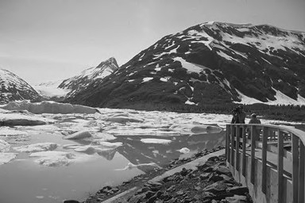
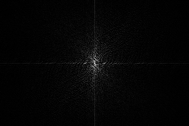
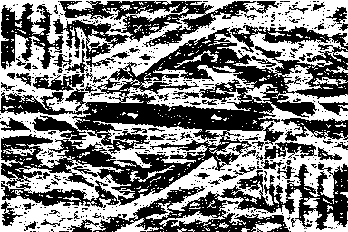
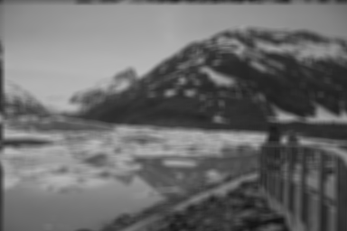

#HW3:Filtering in the Frequency Domain
###林义涵（学号：13331158  计应1班）
##1 Exercises
###1.1 Rotation
The reason why Fig.1(b) appears as it does is the **3rd** step. Fourier transform is conjugate symmetric, it means that \\[F^*(u, v) = F(-u, -v)\\].
It seems like u and v takes a 180 degree rotation, according to the convolution theorem, so does x and y. Hence Fig.1(b) appears as it takes a 180 degree rotation.
###1.2 Fourier Spectrum
Compared to Fig.2(a), Fig.2(c) was padded with zeros, which made it had more slowly changing grey components along the vertical and horizontal axes.  
So the low fequency components had been strengthened, which results in the significant increase in signal strength along the vertical and horizontal axes.
###1.3 Lowpass and Highpass
1. The filtered function is given by
\\[g(x,y)=f(x-1, y+1)+2f(x, y+1)+f(x+1, y+1)-f(x-1, y-1)-2f(x, y-1)-f(x+1, y-1)\\]
From property 3 in Table 4.3,
\\[G(u,v)=F(u,v)e^{j2\pi (-u/M+v/N)} + 2F(u,v)e^{j2\pi (v/N)} + F(u,v)e^{j2\pi (u/M+v/N)} - F(u,v)e^{j2\pi (-u/M-v/N)} - 2F(u,v)e^{j2\pi (-v/N)} - F(u,v)e^{j2\pi (u/M-v/N)}\\]\\[=[e^{j2\pi (-u/M+v/N)} + 2e^{j2\pi (v/N)} + e^{j2\pi (u/M+v/N)} - e^{j2\pi (-u/M-v/N)} - 2e^{j2\pi (-v/N)} - e^{j2\pi (u/M-v/N)}]F(u, v)\\]\\[=H(u,v)F(u,v)\\]
where H(u,v) is the filtered function:
\\[H(u, v)=e^{j2\pi (-u/M+v/N)} + 2e^{j2\pi (v/N)} + e^{j2\pi (u/M+v/N)} - e^{j2\pi (-u/M-v/N)} - 2e^{j2\pi (-v/N)} - e^{j2\pi (u/M-v/N)}\\]\\[=2[sin(2\pi (-u/M+v/N)) + 2sin(2\pi (v/N)) + sin(2\pi (u/M+v/N))]\\]
2. Shifting the filter to the center of the frequency rectangle gives 
\\[H(u, v)=2[sin(2\pi (-(u-M/2)/M+(v-N/2)/N)) + 2sin(2\pi ((v-N/2)/N)) + sin(2\pi ((u-M/2)/M+(v-N/2)/N))]\\]
When (u,v) = (M/2,N/2) (the center of the shifted filter), H(u,v) = 0. For values away from the center, H(u,v) increases because of the order in which derivatives are taken. High frequencies are passed, so this is a high-pass filter.  
##2 Programming Tasks
###2.1 Pre-requirement
**Input** My student ID is "13331158", so my picture is "**58.png**".  
**Language** The language I choose is **Python**, and the library I choose is **PIL**, **Numpy** and **Pylab**.
###2.2 Fourier Transform
1. The **original** picture is:  
  
The **Fourier spectrum** is:  
  
2. The **real part** is:  
  
3. As for the DFT:  
First, new a array called "resource" to get the image data, traverse the input picture and **multiply the pixel with \\((-1)^{x+y}\\)**  

		for i in range(original_height):
             for j in range(original_width):
                 resource[i * original_width + j] *= pow(-1, i + j)
Second, new a array called "fxv" to simplify the 2-Dimension Frourier calculation. That is, the 2-D DFT can be separated into two 1-D DFT as follows.  
(1) Obtain \\(F(x, v)=\Sigma ^{N-1}_{y=0} f(x, y)e^{-j(2\pi vy/N)}\\) using a 1-D DFT along y-axis (row operation).  

		for i in range(original_height):
           for j in range(original_width):
               for m in range(original_height):
                   fxv[i * original_width + j] += resource[m * original_width + j] * \
                            pow(e, complex(0, -2 * pi * (i * m / original_height)))
(2) Obtain \\(F(u, v)=1/M \Sigma ^{M-1}_{x=0} F(x, v)e^{-j(2\pi ux/M)}\\) using a 1-D DFT along x-axis (column operation).  Then, divide each result pixel with original\_width and get the real part.

		for i in range(original_height):
			for j in range(original_width):
                for n in range(original_width):
                   result[i * original_width + j] += fxv[i * original_width + n] * \
                        pow(e, complex(0, -2 * pi * (j * n / original_width)))
                result[i * original_width + j] /= original_width
                result[i * original_width + j] = result[i * original_width + j].real

And the IDFT:  
The procedure is very similar.  
First, there is no need to multiply the pixel with \\((-1)^{x+y}\\).  
Second, new a array called "fxv" to simplify the 2-Dimension Frourier calculation. That is, the 2-D DFT can be separated into two 1-D DFT as follows.  
(1) Obtain \\(F(x, v)=\Sigma ^{N-1}_{y=0} f(x, y)e^{j(2\pi vy/N)}\\) using a 1-D DFT along y-axis (row operation).   

(2) Obtain \\(F(u, v)=\Sigma ^{M-1}_{x=0} F(x, v)e^{j(2\pi ux/M)}\\) using a 1-D DFT along x-axis (column operation).  Then, get the real part and multiply it with \\((-1)^{x+y}\\).  

		for i in range(original_height):
           for j in range(original_width):
                for n in range(original_width):
                   result[i * original_width + j] += fxv[i * original_width + n] * \
                        pow(e, complex(0, 2 * pi * (j * n / original_width)))
                result[i * original_width + j] = result[i * original_width + j].real
                result[i * original_width + j] *= pow(-1, i + j)
                print(i * original_width + j)
###2.4 Filtering in the Frequency Domain
1. The **7\*7 averaging filter** result is:  
  
2. The **variant of Laplacian** I pick is: $$ \begin{bmatrix} 1 & 1 & 1 \\\
 1 & -8 & 1 \\\
 1 & 1 & 1 \\\ \end{bmatrix} $$  
And the result is:  

3. The **filter2d_freq** function, can be used to perform averaging filtering, Laplacian filtering.  
First, the DFT and IDFT parts are the same as **filter2d**. Between two parts, the very important thing is the filter part.

		filter_width = len(filter[0])
    	filter_height = len(filter)
    	filter_input = [0 for i in range(original_width * original_height)]
    	filter_data = [0 for i in range(original_width * original_height)]
    	fxv = [0 for i in range(original_width * original_height)]
Second, calculate the sum of the weights from the filter. If the sum **is not 0**, then it means the **averaging filtering model**, else it means the other models. Traverse the input filter and **multiply the pixel with \\((-1)^{x+y}\\)**    

		sum_weight = 0
    	for i in range(filter_height):
        	for j in range(filter_width):
            	sum_weight += filter[i][j]
            	filter[i][j] *= pow(-1, i + j)
            	filter_input[i * original_width + j] = filter[i][j]
Finally, use the filter to come up with a DFT filter and multiply it with the DFT image.  

        for i in range(original_height):
        	for j in range(original_width):
            	for n in range(original_width):
                	filter_data[i * original_width + j] += fxv[i * original_width + n] * \
                    	pow(e, complex(0, -2 * pi * (j * n / original_width)))
            		filter_data[i * original_width + j] /= original_width
            		result[i * original_width + j] *= filter_data[i * original_width + j]