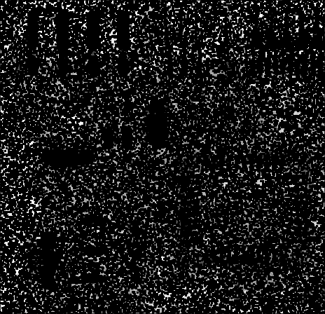

#HW4:Image Restoration and Color Image Processing
###林义涵（学号：13331158  计应1班）
##1 Exercises
###1.1 Color Spaces
1. The HSI color space is more suitable for digitalized color processing, where the HSI color space is  advantageous to the RGB color space. So the RGB color space is used less in science research, because it is hard to make digital adjustment.  
But the RGB model is the most popular hardware-oriented color model. The RGB model is used widely in the colorful monitors and videos, where RGB is advantageous to HSI.
2. When the Hue component is on the yellow-green sector, it will be transformed into green-cyan sector. When the Hue component is on the green-cyan sector, it will be transformed into cyan-blue sector. When the Hue component is on the cyan-blue sector, it will be transformed into blue-peony sector. When the Hue component is on the blue-peony sector, it will be transformed into peony-red sector. When the Hue component is on the peony-red sector, it will be transformed into red-yellow sector. When the Hue component is on the red-yellow sector, it will be transformed into yellow-green sector.
###1.2 Color Composition
Suppose composing a given color with coordinate **c4(x4, y4)**.   
First use the coordinates of three points to calculate the area of the triangle. Then use the areas of the triangles to calculate the relative percentages.  

The area of the triangle which vertexes are **c1, c2 and c4** is:
\\[S(c\_1c\_2c\_4)=({1\over 2})*(x\_1y\_2+x\_2y\_4+x\_4y\_1-x\_1y\_4-x\_2y\_1-x\_4y\_2)\\]  

The area of the triangle which vertexes are **c1, c3 and c4** is:
\\[S(c\_1c\_3c\_4)=({1\over 2})*(x\_1y\_3+x\_3y\_4+x\_4y\_1-x\_1y\_4-x\_3y\_1-x\_4y\_3)\\]  

The area of the triangle which vertexes are **c2, c3 and c4** is:
\\[S(c\_2c\_3c\_4)=({1\over 2})*(x\_2y\_3+x\_3y\_4+x\_4y\_2-x\_2y\_4-x\_3y\_2-x\_4y\_3)\\]  

The area of the triangle which vertexes are **c1, c2 and c3** is:
\\[S(c\_1c\_2c\_3)=({1\over 2})*(x\_1y\_2+x\_2y\_3+x\_3y\_1-x\_1y\_3-x\_2y\_1-x\_3y\_2)\\]  

Thus, the relative percentage of **c1** is:
\\[P(c\_1)={S(c\_2c\_3c\_4) \over S(c\_1c\_2c\_3)}={(x\_2y\_3+x\_3y\_4+x\_4y\_2-x\_2y\_4-x\_3y\_2-x\_4y\_3) \over (x\_1y\_2+x\_2y\_3+x\_3y\_1-x\_1y\_3-x\_2y\_1-x\_3y\_2)}\\]  

The relative percentage of **c2** is:
\\[P(c\_2)={S(c\_1c\_3c\_4) \over S(c\_1c\_2c\_3)}={(x\_1y\_3+x\_3y\_4+x\_4y\_1-x\_1y\_4-x\_3y\_1-x\_4y\_3) \over (x\_1y\_2+x\_2y\_3+x\_3y\_1-x\_1y\_3-x\_2y\_1-x\_3y\_2)}\\]  

The relative percentage of **c3** is:
\\[P(c\_3)={S(c\_1c\_2c\_4) \over S(c\_1c\_2c\_3)}={(x\_1y\_2+x\_2y\_4+x\_4y\_1-x\_1y\_4-x\_2y\_1-x\_4y\_2) \over (x\_1y\_2+x\_2y\_3+x\_3y\_1-x\_1y\_3-x\_2y\_1-x\_3y\_2)}\\]
##2 Programming Tasks
###2.1 Pre-requirement
**Input** My student ID is "13331158", so my picture is "**58.png**".  
**Language** The language I choose is **Python**, and the library I choose is **PIL**, **Numpy** and **Pylab**.
###2.2 Image Filtering
1. The **3\*3 arithmetic mean filter** result is:  
  
The result looks like a little thiner, shorter and darker.And the edges are not so clear.  
The **9\*9 arithmetic mean filter** result is:  
  
The result looks like a cylinder, it means more stereo. The color becomes more grey.And the edges become more blurred.  
2. The **3\*3 harmonic mean filter** result is:  
  
The result becomes thicker. The edges and the color remain the same.  
The **9\*9 harmonic mean filter** result is:  
  
The result becomes much more thicker. The edges and the color remain the same. 
3. The **3\*3 contraharmonic mean filter** result is:  
  
The result becomes thicker. The edges and the color remain the same.  
The **9\*9 contraharmonic mean filter** result is:  
  
The result becomes much more thicker. The edges and the color remain the same. 
###2.3 Image Denoising
1. The **add\_noise** function, can be used to **add Gaussian noise or salt-and-pepper (impulse) noise** to an image. It has **3** parameters.  
The **"input_img"** means the input image.  
The **"noiseType"** means the noise type, when it is 1, it means the Gaussian noise.When it is 0, it means the salt and pepper noise.  
The **"para"** means the parameters for the noise. When the noise is the Gaussian noise, para[0] means the mean and para[1] means the standard variance. When the noise is the salt and pepper noise, para[0] means the probability for pepper noise, and para[1] means the probability for salt noise.  
When the noise type is the **Gaussian noise**, add noise like below:

		for i in range(original_height):
            for j in range(original_width):
                v1 = random.random()
                v2 = random.random()
                tmp = math.sqrt(-2 * math.log(v1)) * math.cos(2 * math.pi * v2) * para[1] + para[0];
                tmp += resource[i * original_width + j]
                result[i * original_width + j] = int(tmp)
When the noise type is the **salt and pepper noise**, add noise like below:

		for i in range(original_height):
            for j in range(original_width):
                v1 = random.random()
                tmp = 0
                if v1 <= para[0]:
                    tmp = -500
                elif v1 >= 1 - para[1]:
                    tmp = 500
                tmp += resource[i * original_width + j]
                result[i * original_width + j] = int(sum)
2. The **noisy image** is:  
  
The **3\*3 arithmetic mean filtering** result is:  
  
The **3\*3 geometric mean filtering** result is:  
  
The **3\*3 median filtering** result is:  
  
As you can see from the results, I think the **3\*3 arithmetic mean filtering** result is better than the **3\*3 median filtering** result, and the **3\*3 geometric mean filtering** result is the worst.  
Because the 3\*3 geometric mean filtering result has added some pepper noise, since a pixel with 0 could make other pixels around it become 0 too. The 3\*3 arithmetic mean filtering result looks less clear than it but has least noise.
3. The **noisy image** is:  
  
The **3\*3 harmonic mean filtering** result is:  
  
The **3\*3 contraharmonic mean filtering** result with Q = 1 is:  
  
The **3\*3 contraharmonic mean filtering** result with Q = -1 is:  
  
As you can see from the results, I think the **3\*3 contraharmonic mean filtering** result with Q = -1 is a little better than the **3\*3 harmonic mean filtering** result, and the **3\*3 contraharmonic mean filtering** result with Q = 1 is the worst.  
Because the 3\*3 contraharmonic mean filtering result with Q = -1 has least salt noise. The 3\*3 contraharmonic mean filtering result with Q = 1 has much more salt noise, since it is not suitable for pepper denoise.  
4. The **noisy image** is:  
  
The **3\*3 arithmetric mean filtering** result is:  
  
The **3\*3 geometric mean filtering** result is:  
  
The **3\*3 max filtering** result is:  
   
The **3\*3 min filtering** result is:  
  
The **3\*3 median filtering** result is:  
  
As you can see from the results, I think the 3\*3 median filtering result is better than the 3*3 arithmetric mean filtering result. The 3*3 geometric mean result, the 3*3 max filtering result and the 3*3 min filtering result become worse.  
Because the 3\*3 median filtering result could avoid both salt noise and pepper noise. However 3*3 geometric mean result the 3*3 max filtering result and the 3*3 min filtering enhance salt noise or pepper noise.
5. The **3\*3 arithmetric mean filtering**:  
add the pixels around the target and divide the sum by the weight sum.  
The **3\*3 geometric mean filtering**:  
multiple the pixels around the target and extract the root of the sum by the weight sum.  
The **3\*3 harmonic mean filtering**:  
add the reciprocals of pixels around the target and divide the weight sum by the sum.  
The **3\*3 max filtering**:  
find the biggest pixel around the target.  
The **3\*3 min filtering**:  
find the smallest pixel around the target.  
The **3\*3 median filtering**:  
put the pixels around the target into a list, make a sort and find the middle pixel.  
###2.4 Histogram Equalization on Color Images
1. The result image is:  
  
2. The result image is:  
  
3. As we can see from the results, the former result has exceeding exposure, and hue component looks wired. The  hue component of the after result is more  similar to the original image and looks more normal.  
This is because the histograms from RGB channels are different. So the histogram-equalization effects are different. The after result is more global harmonious.